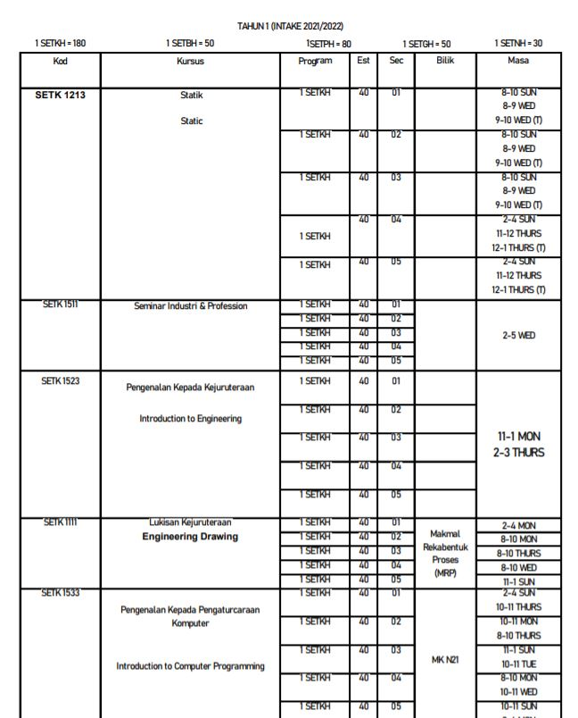
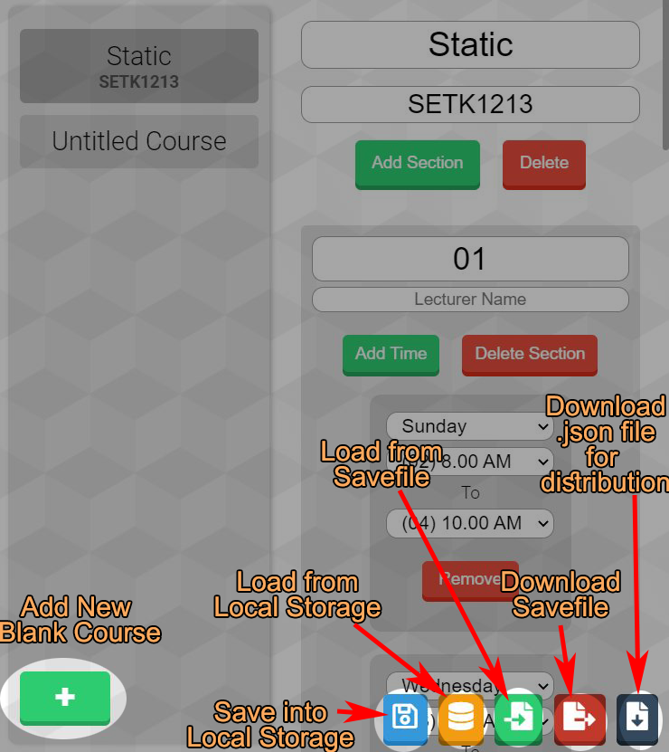

# Course JSON Generator

[__Link Here__](https://admijw.github.io/Course-JSON-Generator/)

by AdmiJW


Universiti Teknology Malaysia had many schools, each school is responsible for several programmes, and every semester, each school will release their own timetable of the courses in order for the students to do pre-registration and registration. 

Here's an example of such timetable:



_(This is schedule list from School of Chemical & Energy Engineering - 2021/2022 Semester 1)._

---

The schedule usually comes in the form of pdf, and different school will have different format of them. Therefore, attempting to convert them into some unified format, like `.json`, will mostly take manual work.

This application, __Course JSON Generator__ relieves the manual work by providing a better UI and workflow instead of having to convert the schedule into `.json` by typing inside some text editor.




---

# Commands

Adding a course by interacting with interface maybe too slow! You want it __FAST__? Introducing __Command__ feature!

Here is a list of available commands (Maybe I will update later? Maybe not?):

|Command|Description|
|-|-|
| [`addcourse`](#addcourse) | Adds a new course |
| [`addcourse_n`](#addcourse\_n) | Add multiple courses at once. `addcourse` on drug |

To execute a command, press `ENTER` after you typed in the command into the input field

__For convenience, the command parser will automatically remove leading and trailing whitespaces in each token of the command (`\n` and \t`). This allows direct copy paste from beautified, indented commands, like:__

```
addcourse_n;5;
	Static;SETK 1213;5;
		S;01;;2;
			T;0;8;10;
			T;3;8;10;
		S;02;;2;
			T;0;8;10;
			T;3;8;10;
		S;03;;2;
			T;0;8;10;
			T;3;8;10;
		S;04;;2;
			T;0;14;16;
			T;4;11;13;
		S;05;;2;
			T;0;14;16;
			T;4;11;13;
```

where tokens like `\t\tMy Course    \n` will be trimmed to `My Course` only.

<br>

---


## `addcourse`

Add a course by `addcourse` command takes the following form:

```
addcourse;<CoursePart>
```

---

A `<CoursePart>` takes the following form:

```
courseName?;courseCode;n_sections;<SectionPart>?+
```

|Token|Description|
|-|-|
|`courseName`| Course Name. Can be left blank |
|`courseCode`| Course Code. Can be left blank |
|`n_sections`| Number of sections in this course. The parser will expect to see `n_sections` of `<SectionPart>` next and throw error if didn't |

For example, the following command adds a course with no section whatsoever:

```
addcourse;My Course;ABCD 123;
```

---

A `<SectionPart>` takes the following form:

```
S;sectionNo;lecturerName;n_times;<TimePart>?+
```

|Token|Description|
|-|-|
|`S`| Used to indicate a beginning of `<SectionPart>` |
|`sectionNo`| Section Number. Can be left blank |
|`lecturerName`| Lecturer Name. Can be left blank |
|`n_times`| Number of class sessions in this course. The parser will expect to see `n_times` of `<TimePart>` next and throw error if didn't |


For example, the following command adds a course with 2 sections, but no times specified

```
addcourse;My Course;ABCD 123;2;S;01;Dr Ali;0;S;02;Dr Ahmad;0
```

Prettified:

```
addcourse;My Course;ABCD 123;2;
    S;01;Dr Ali;0;
    S;02;Dr Ahmad;0
```

---

A `<TimePart>` takes the following form:

```
T;dayOfWeek;beginTime;endTime
```

|Token|Description|
|-|-|
|`T`| Used to indicate a beginning of `<TimePart>` |
|`dayOfWeek`| Integer [0-6]. 0 is Sunday, 1 is Monday etc. You can also use shortforms __(CASE SENSITIVE)__ - `SUN`, `MON`, `TUE`, `WED`, `THU`, `FRI`, `SAT` |
|`beginTime`| Integer [0-23]. 0 is 12AM, 1 is 1AM etc. You may also use 12 hour format __(CASE SENSITIVE)__ - `12AM`, `1AM`...`10PM`, `11PM` |
|`endTime`| Integer [0-23]. Same as above. Should be greater than `beginTime`. 12 hour format supported  __(CASE SENSITIVE)__|


For example, the following command adds a course with 1 section, with 2 classes: Sunday 8AM - 10AM, Tuesday 2PM - 4PM

```
addcourse;My Course;ABCD 123;1;S;01;Dr Ali;2;T;0;8;10;T;2;2PM;4PM
```

Prettified:

```
addcourse;My Course;ABCD 123;1;
    S;01;Dr Ali;2;
        T;0;8;10;
        T;TUE;2PM;4PM
```

<br><br>

---

## `addcourse_n`

Even `addcourse` is too slow? We heard you. Introducing `addcourse_n`:

```
addcourse_n;n_courses;<CoursePart>?+
```

|Token|Description|
|-|-|
|`n_courses`| Number of courses. The parser will expect to see `n_courses` of `<CoursePart>` next and throw error if didn't |

Here's an example to add two courses:

```
addcourse_n;2;Course A;A123;0;Course B;B123;0
```

> With `addcourse_n`, you can draft your courses in a `.txt` file first, only to be added later!